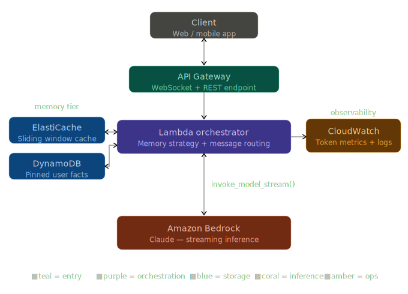

# System Design — Stateful Multi-Turn Assistant on AWS

---

## Request path (top → bottom)

Client sends a message over WebSocket → API Gateway handles the persistent connection and routes the event → Lambda wakes up, applies your memory strategy, and assembles the trimmed message array → `invoke_model_with_response_stream` on Bedrock returns tokens one at a time → Lambda forwards each chunk back through API Gateway to the client.

## Memory tier (left of Lambda)

ElastiCache holds the raw message history for the current session — fast reads, TTL-based expiry, perfect for sliding window and token budget. DynamoDB holds the facts that must survive session expiry: name, preferences, allergies, anything the user has explicitly anchored. Lambda reads both on every turn and writes back after each Bedrock response.

## Observability (right of Lambda)

Every Bedrock call emits input/output token counts to CloudWatch. This is what makes the token budget strategy actually manageable in production — you can set alarms when a user segment is burning through context faster than expected, and feed that data into your pricing tier decisions.

---

## What this design gives you beyond the browser lab

- **VPC isolation** — Lambda, ElastiCache, and Bedrock calls all stay within the VPC — no public egress for conversation data
- **Per-call cost attribution** via CloudWatch Insights — query by `user_id` to see p95 token spend
- **WebSocket** keeps the connection alive for streaming, so tokens flow back to the client without polling
- **DynamoDB's `user_id` partition key** means persistent facts survive across sessions, devices, and conversation resets — the thing none of the three in-memory strategies can do alone
