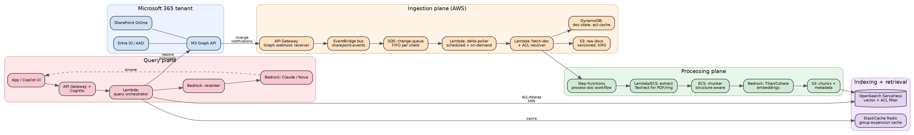
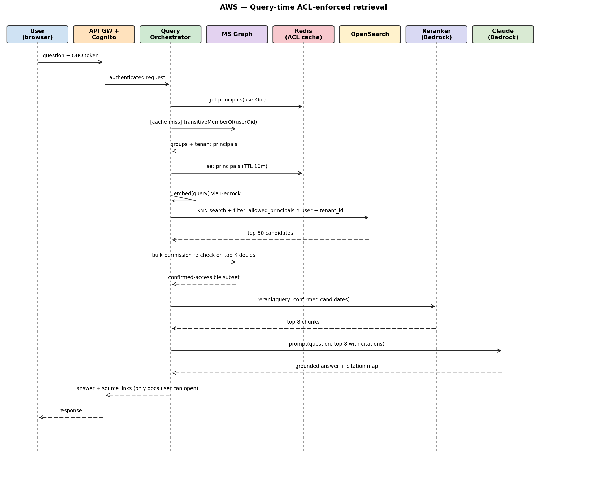

# RAG over SharePoint on AWS — System Design

**Author:** B
**Date:** 2026-05-21
**Status:** Draft v1 (Staff-PM interview depth)

---

## 1. Goal and constraints

Build an enterprise RAG system that answers questions over SharePoint Online content with **strict permission parity**: a user can only see content from documents they themselves have permission to read in SharePoint at the moment of the query.

**Hard requirements**
- ACLs are inherited from SharePoint **before** chunking. Every chunk written to the vector store carries the resolved ACL of its source document.
- Retrieval must filter on the requester's effective principals before any chunk is returned to the generation step. No post-hoc redaction.
- MS Graph is the source of truth for content + permissions + change events (webhooks / change notifications + delta queries).
- Freshness target: P95 < 5 minutes from SharePoint edit to query-able index update.

**Non-goals (v1)**
- Cross-tenant search.
- Indexing of legacy on-prem SharePoint Server (only SharePoint Online via Graph).
- Generation model fine-tuning (we use a hosted FM via Bedrock).

---

## 2. Architecture overview



---

## 3. Identity and entitlements model

The whole design hinges on the ACL contract, so we define it first.

**Principals.** A user's effective set of principals at query time is `{userId} ∪ {transitive group memberships} ∪ {"Everyone except external users"} ∪ {tenant-wide groups}`. Resolved via `GET /users/{id}/transitiveMemberOf` on MS Graph. Cached in Redis with a 10-minute TTL plus invalidation on `directoryAudits` group-change events.

**Document ACL.** For each SharePoint item we resolve the full effective permission set: direct grants on the item, inherited site/library grants, sharing links (resolved to principal sets), and broken-inheritance overrides. Stored as a JSON blob and a flattened `allowed_principals: [oid, ...]` array on every chunk record. We do not store deny entries — SharePoint's permission model is grant-based with the union being the user's effective access; if a user is not in any grant set they cannot see the doc.

**Stamping rule.** A chunk is never written to OpenSearch unless its `allowed_principals` array is populated and the source ACL version matches what we just read. If ACL resolution fails for any reason, we fail the doc-processing workflow rather than write a chunk with an empty or stale ACL.

**Match rule at retrieval.** kNN query is wrapped in a filter `terms: { allowed_principals: <requester's principals> }` with an `AND` against any tenant-scoping filters. The orchestrator additionally re-validates the top-K against a live MS Graph permission check before returning sources to the LLM (defense in depth — catches the case where a permission was revoked in the last few seconds).

---

## 4. Ingestion plane

### 4.1 Event capture from MS Graph

Two complementary mechanisms, because neither alone is sufficient:

1. **Change notifications (webhooks).** Subscriptions on `/sites/{site-id}/drive/root` and `/sites/{site-id}/lists/{list-id}` resources. Graph posts to API Gateway → EventBridge. Subscriptions expire every ~3 days; a Lambda renewer keeps them alive.
2. **Delta queries.** A scheduled poller (`EventBridge Scheduler` every 2 min per tenant) calls `delta` on each drive to catch missed events (Graph webhooks are best-effort, not guaranteed). Delta tokens are persisted in DynamoDB.

Why both: webhooks give us seconds-latency for the common case; delta polling closes the durability gap.

**Permission-change events.** Webhooks on `/security/auditLog` and group-membership audits land in the same bus. These trigger (a) Redis ACL-cache invalidation and (b) re-index of documents whose ACLs are now stale.

### 4.2 Fetch and ACL resolution

`fetch-doc` Lambda, per change event:
1. Read item metadata + content stream via Graph `driveItem` endpoints.
2. Resolve ACLs:
   - `GET /sites/{id}/drive/items/{id}/permissions` for the item.
   - Walk up the inheritance chain if `inheritedFrom` is set.
   - Expand sharing-link permissions to principal sets.
   - Expand groups one level (we keep groups as principals in the index, not flattened users — flattening blows up index size and forces re-index on every membership change).
3. Write raw bytes to S3 (`s3://raw-docs/<tenant>/<site>/<driveItem>/<etag>/`), versioned and KMS-encrypted with a tenant-scoped CMK.
4. Update DynamoDB `doc-state` row: `{docId, etag, aclVersion, aclHash, lastProcessedAt, status}`.
5. Enqueue the Step Functions workflow.

**Idempotency.** Keyed on `(docId, etag, aclHash)`. If nothing changed we exit before doing embedding work.

### 4.3 Tenancy and isolation

One AWS account per region; logical tenant isolation via:
- Tenant-scoped KMS CMKs (`alias/rag-tenant-<id>`).
- Tenant prefix in S3 + DynamoDB partition keys.
- Per-tenant OpenSearch collection (Serverless billing scales down for small tenants, large tenants get dedicated collections).
- IAM policies enforce prefix-level access for every Lambda.

---

## 5. Processing: extract, chunk, embed

Orchestrated by Step Functions for visibility and retries; one execution per document version.

**Extract.** Textract for PDFs / scanned content, Tika-on-ECS for Office formats not natively text, native parsing for `.docx`/`.pptx`/`.xlsx`/`.md`/`.html` via python-docx, python-pptx, openpyxl. Output is a normalized structured doc: `{sections: [{heading, paragraphs, tables, page_ref}]}`.

**Chunking.** Structure-aware, not naive token windows:
- Primary boundary: section headings.
- Within a section: ~400 tokens target, ~80 token overlap, never splitting mid-table or mid-list.
- For spreadsheets: one chunk per logical sheet region (header + contiguous rows), with the sheet name preserved.
- Each chunk carries: `{chunkId, docId, etag, allowed_principals, parent_section, page_ref, source_url, content_hash}`.

**Embedding.** Amazon Bedrock — Titan Text Embeddings v2 (1024-dim) as the default; pluggable so we can A/B Cohere Embed v3 multilingual for tenants with non-English content. Batched calls (25 chunks per invoke) for throughput.

**Write to index.** Bulk indexing into OpenSearch Serverless with `refresh_interval=10s`. ACL field is `keyword` type, `allowed_principals` is the only filter we require to be present and non-empty (enforced at the ingest pipeline via an OpenSearch ingest processor — chunks missing the field are rejected).

---

## 6. Indexing: vector store schema

OpenSearch Serverless (vector engine) chosen over Kendra and over self-managed because:
- Native k-NN with HNSW + pre-filter on keyword fields (the ACL filter applies *before* the vector search, not as a post-filter — critical for both correctness and recall when a user has access to only a small fraction of the corpus).
- Serverless scaling matches bursty enterprise ingestion.
- Same cluster can serve BM25 for hybrid retrieval.

```json
{
  "mappings": {
    "properties": {
      "chunk_id":           { "type": "keyword" },
      "doc_id":             { "type": "keyword" },
      "tenant_id":          { "type": "keyword" },
      "site_id":            { "type": "keyword" },
      "etag":               { "type": "keyword" },
      "acl_version":        { "type": "long" },
      "allowed_principals": { "type": "keyword" },
      "source_url":         { "type": "keyword" },
      "title":              { "type": "text" },
      "section_path":       { "type": "keyword" },
      "content":            { "type": "text" },
      "content_vec":        { "type": "knn_vector", "dimension": 1024,
                              "method": { "name": "hnsw", "space_type": "cosinesimil" } },
      "modified_at":        { "type": "date" }
    }
  }
}
```

**Deletion / re-index.** When a doc is deleted or its ACL changes, we delete-by-query on `doc_id` and re-ingest. We deliberately do not do partial-ACL-update-in-place — too easy to leave a stale chunk. Cost of re-embedding is the price of correctness.

---

## 7. Retrieval and query plane



**Why two ACL checks.** The index filter is the primary correctness mechanism; the bulk Graph re-check on the top-K (~50 doc IDs, one batched Graph call, ~80 ms) catches sub-cache-TTL revocations and is cheap because it runs only on a small candidate set. We never re-check after generation — by then it's too late.

**Hybrid retrieval.** Vector kNN + BM25 with reciprocal-rank fusion. BM25 catches exact phrase / acronym / identifier lookups that embeddings smear over.

**Citations.** Every claim in the generated answer is required to be backed by a chunkId. The orchestrator strips claims without a backing chunk before returning to the user.

---

## 8. Scale, performance, cost

| Dimension | v1 target | Notes |
|---|---|---|
| Tenants | 50 | Mid-market + a few large |
| Docs indexed | 100M chunks (~5M docs) | Avg 20 chunks/doc |
| Ingest throughput | 200 docs/sec sustained, 2k burst | Step Functions + Lambda concurrency caps |
| Query QPS | 200 sustained, 1k burst | Cognito-authenticated only |
| Retrieval P95 | < 800 ms end-to-end (excl. LLM) | OS kNN ~120 ms, Graph re-check ~80 ms, rerank ~200 ms |
| Freshness P95 | < 5 min | Webhook path is usually < 30 s; delta-poll is the long tail |
| Monthly cost (50 tenants, 100M chunks, 50k queries/day) | ~$48k | Bedrock embeddings + OS Serverless dominate; itemized in appendix |

---

## 9. Failure modes and mitigations

| Failure | Blast radius | Mitigation |
|---|---|---|
| Graph webhook missed | Stale doc until next delta poll | Delta poll every 2 min closes the gap; freshness SLO covers this |
| Graph throttling (429) | Ingestion slows for a tenant | Per-tenant token bucket in Lambda, exponential backoff, SQS retains the work |
| ACL resolution fails for a doc | That doc not indexed | Workflow marked failed in DDB; alarm if >0.1% docs in failed state for >1h; never write a chunk without ACL |
| Group expansion stale (user removed from group seconds ago) | User sees a chunk they should not | Top-K Graph re-check catches it; Redis invalidation on directoryAudit shrinks the window further |
| OpenSearch collection unavailable | Queries fail | Multi-AZ Serverless gives 99.9%; degraded mode returns BM25-only on Aurora-stored chunks |
| Bedrock model rate-limited | Generation degrades | Fallback to a smaller model, surface "best-effort" banner; queue non-interactive ingestion embeddings |
| Tenant data leakage across collections | Catastrophic | Tenant ID is in IAM policy conditions, KMS key per tenant, separate collections; chaos test quarterly |
| Sharing-link explosion (one doc shared with 'anyone in org') | Index works but answer leaks to wrong audience | Sharing links resolved to principal sets; "anyone-with-link" treated as tenant-wide group, not as "Everyone" |

---

## 10. Observability and security

- **Metrics:** per-tenant ingest lag, ACL-resolution failure rate, top-K Graph re-check disagree rate (the canary for ACL drift), retrieval recall@10 on a golden eval set.
- **Audit log:** every query logged with `{user, tenant, query, returned_chunk_ids, returned_doc_ids, model, latency}` to an immutable S3 bucket; retained per tenant policy.
- **Eval harness:** nightly run of a golden query set per tenant including **permission-negative tests** — queries that should return no result for a given user — failure here pages the on-call.
- **Encryption:** KMS CMK per tenant for S3 + DDB + OpenSearch. TLS everywhere. No PII in logs.
- **PII handling:** content with detected PII (Macie scan on S3) gets a `sensitivity_tag` and is excluded from cross-tenant analytics but still indexed for the tenant.

---

## 11. Key trade-offs (Staff-PM lens)

1. **Per-chunk ACL stamping vs. per-doc ACL with join at query.** We chose per-chunk because OpenSearch's pre-filter on `keyword` is cheap and the alternative (joining against a DDB ACL table per candidate) adds 50–100 ms and a failure mode. Cost: index storage ~15% larger.
2. **Re-index on ACL change vs. in-place ACL update.** Re-index is safer (no chance of a stale chunk surviving a permission revocation) but costs embedding $$. Acceptable because ACL-only changes are rare relative to content changes.
3. **Group principals in the index vs. flattened user lists.** Groups keep the index stable when memberships churn; we accept one extra Graph call at query time for membership expansion (cached).
4. **Two ACL checks (index filter + Graph re-check) vs. one.** The Graph re-check costs ~80 ms but lets us claim revocation-latency seconds rather than minutes — a real enterprise procurement requirement.
5. **OpenSearch Serverless vs. Kendra.** Kendra has built-in SharePoint connectors and ACL handling but is a black box on ranking, expensive at our scale, and doesn't let us own the chunking strategy or do hybrid retrieval cleanly. We took the more work / more control path.

---

## Appendix A — cost itemization (steady state)

| Line | $/month |
|---|---|
| Bedrock Titan embeddings (re-embedding churn ~20%/mo) | $14k |
| OpenSearch Serverless (8 OCU avg, 100M chunks) | $18k |
| Bedrock Claude generation (50k queries × ~3k tok) | $9k |
| Lambda + Step Functions + EventBridge | $2k |
| S3 + DDB + Redis + KMS | $3k |
| Data transfer, CloudWatch, Macie | $2k |
| **Total** | **~$48k** |
