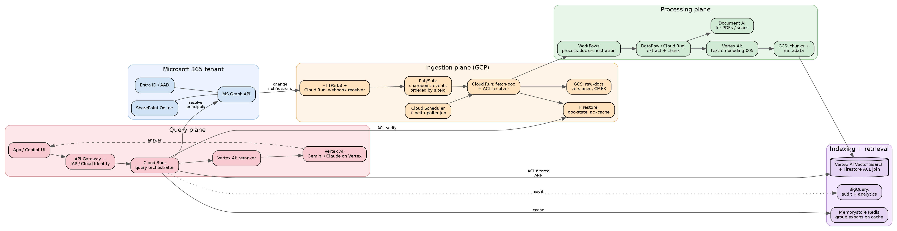
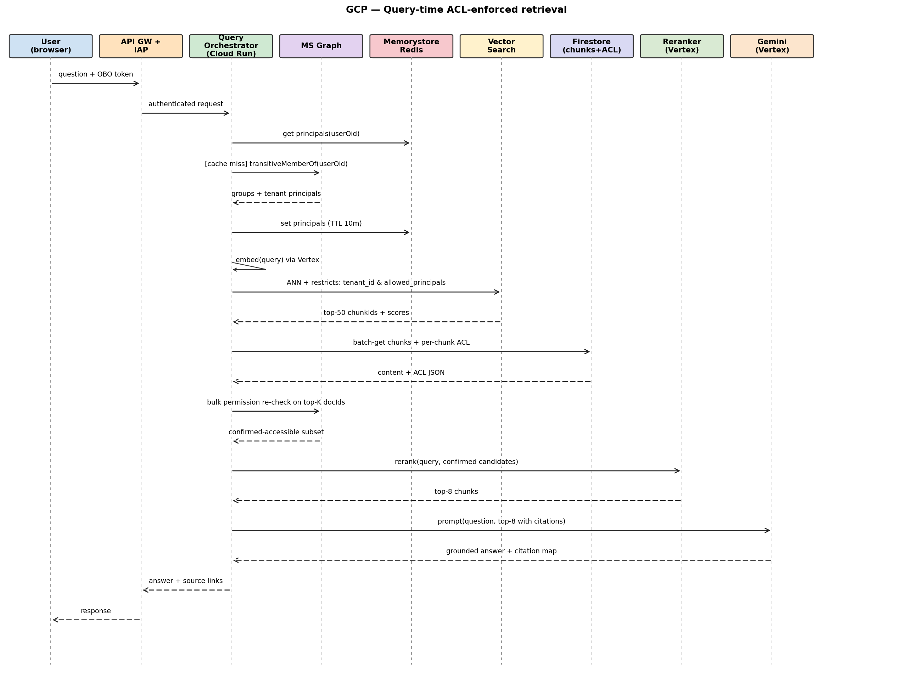

# RAG over SharePoint on GCP — System Design

**Author:** B
**Date:** 2026-05-21
**Status:** Draft v1 (Staff-PM interview depth)

---

## 1. Goal and constraints

Same product as the AWS variant: enterprise RAG over SharePoint Online via MS Graph, with strict permission parity. ACLs inherited from SharePoint **before** chunking, stamped on every chunk in the vector store, and matched against the requester's principals at query time before any output is returned.

**Hard requirements** (identical to AWS design — restated for self-containment)
- Pre-chunk ACL inheritance; per-chunk ACL stamping.
- Retrieval-time ACL filter applied before generation, plus a defense-in-depth Graph re-check on top-K.
- MS Graph for content + permissions + change notifications + delta queries.
- Freshness P95 < 5 min from SharePoint edit to query-able.

**Why a GCP variant exists.** Tenant procurement requirements vary — some require workloads stay within GCP (data-residency commitments, existing Vertex spend, BigQuery analytics fabric). Architectural shape is identical; service substitutions are local.

---

## 2. Architecture overview



---

## 3. Identity and entitlements model

Identical contract to the AWS design; restated briefly.

**Principals at query time:** `{userOid} ∪ {transitive group memberships} ∪ {tenant-wide groups}` from `GET /users/{id}/transitiveMemberOf`. Cached in Memorystore Redis (10-min TTL, invalidated by directoryAudits webhook).

**Document ACL:** Effective permission set resolved before chunking — direct grants, inherited grants, sharing-link expansions, broken-inheritance overrides. Stored as a JSON blob in Firestore and as a flattened `allowed_principals: [oid, ...]` array on every chunk record.

**Stamping rule:** No chunk is written to Vector Search unless `allowed_principals` is populated and the source ACL version matches what we just read. ACL resolution failure ⇒ workflow failure, not a chunk with a missing ACL.

**Match rule at retrieval:** Vertex Vector Search supports **namespace + numeric/string restricts** on each datapoint. We use string restricts (`allowed_principals`) as the pre-filter, evaluated before ANN. A defense-in-depth Graph permission re-check runs on top-K before generation.

---

## 4. Ingestion plane

### 4.1 Event capture from MS Graph

Same two-mechanism strategy as AWS:

1. **Change notifications:** Graph webhook subscriptions on `/sites/{id}/drive/root` and lists. Notifications land on a public HTTPS Load Balancer fronting a Cloud Run service, which validates the clientState, acks Graph, and publishes to Pub/Sub. Subscription renewal is a separate Cloud Run job triggered by Cloud Scheduler.
2. **Delta polling:** Cloud Scheduler hits a `delta-poller` Cloud Run job every 2 minutes per tenant. Delta tokens stored in Firestore.

Permission-change events (`/security/auditLog`, group-membership audits) feed the same bus; they trigger Redis cache invalidation and re-index of affected docs.

### 4.2 Fetch and ACL resolution

`fetch-doc` Cloud Run service (autoscaled, min-instances=2 per tenant tier):
1. Read item bytes + metadata via Graph.
2. Resolve ACLs: item perms → inherited perms (walk `inheritedFrom`) → sharing-link expansions → group expansion (one level — groups remain principals in the index).
3. Write raw bytes to GCS (`gs://raw-docs-<region>/<tenant>/<site>/<driveItem>/<etag>/`), versioned, encrypted with a tenant CMEK from Cloud KMS.
4. Update Firestore `doc-state` doc: `{docId, etag, aclVersion, aclHash, lastProcessedAt, status}`.
5. Trigger the Workflows execution for processing.

**Idempotency key:** `(docId, etag, aclHash)`.

### 4.3 Tenancy and isolation

- One GCP project per region for the platform; tenant isolation is logical.
- Tenant CMEKs in Cloud KMS (one keyring per tenant).
- Tenant prefix in GCS + Firestore + Pub/Sub topic subscription filter.
- **Per-tenant Vector Search index** for medium/large tenants; a shared multi-tenant index with strict `namespace=tenantId` restrict for the long tail of small tenants. Namespace + restrict is enforced at the IAM-bound service account level — the query orchestrator's SA only has rights to query within the requester's tenant namespace.
- VPC Service Controls perimeter around all data services prevents exfil to non-perimeter projects.

---

## 5. Processing: extract, chunk, embed

Workflows (Google's orchestration product) drives one execution per doc version. The heavy lifting runs in Dataflow for large-batch ingest (initial backfill of a tenant) and Cloud Run for steady-state per-doc work.

**Extract.** Document AI for PDFs and scanned images (it handles layout + tables well), Tika-on-Cloud-Run for legacy Office formats, native parsers for `.docx`/`.pptx`/`.xlsx`/`.md`/`.html`. Output is the same normalized structured-doc JSON as the AWS design.

**Chunking.** Identical strategy — structure-aware, ~400 token target, ~80 overlap, never split mid-table, sheet-region chunks for spreadsheets. Same chunk metadata schema.

**Embedding.** Vertex AI `text-embedding-005` (768-dim) as default; pluggable to Vertex's `text-multilingual-embedding-002` for non-English tenants. Batched (250 chunks per call — Vertex's batch limit is higher than Bedrock's).

**Write to index.** Vector Search `upsertDatapoints` API. Each datapoint:
```json
{
  "datapoint_id": "<chunkId>",
  "feature_vector": [ ... 768 floats ... ],
  "restricts": [
    { "namespace": "tenant_id",          "allow_list": ["<tenant>"] },
    { "namespace": "allowed_principals", "allow_list": ["oid1","oid2","group1", ...] }
  ],
  "crowding_tag": "<doc_id>"
}
```

`crowding_tag=doc_id` prevents one document from monopolizing the top-K. Chunk content + metadata live in Firestore (cheap doc lookup) and BigQuery (analytics/eval). Vector Search stores only vectors + restricts.

---

## 6. Indexing: vector store schema

Vertex AI Vector Search chosen over AlloyDB pgvector and over a self-managed cluster because:
- Managed ANN with restricts evaluated pre-search (correctness + recall preserved when a user has access to only a sliver of the corpus).
- Approximate updates land in seconds (streaming updates index).
- Integrates with Vertex embeddings + Gemini in-region (no cross-cloud egress for the inference hot path).

**Companion stores.**
- **Firestore `chunks` collection:** full chunk content + ACL JSON + structural metadata, keyed by `chunkId`. Read after vector hits to assemble the prompt.
- **Firestore `acl` collection:** authoritative ACL per doc, used by the orchestrator for the Graph-redundant top-K verify (Firestore is faster than Graph and the freshness is bounded by our own ingestion).
- **BigQuery `chunks_meta`:** for eval, analytics, golden-set queries.

**Deletion / re-index.** On doc delete or ACL change: query Vector Search for all datapoints with `doc_id` restrict, batch-remove, re-ingest. Same correctness-over-cost trade as the AWS variant.

---

## 7. Retrieval and query plane



**Same two ACL gates as AWS:** Vector Search restrict (primary), Graph re-check on top-K (revocation-latency defense). The Firestore ACL fetch in step 4 is a third gate — and it's cheap — used to catch the case where a chunk somehow slipped past with stale ACL (it should not, but the check costs <10 ms and makes the audit story clean).

**Hybrid retrieval.** Vector Search ANN fused with a BM25 pass over a Firestore full-text index (or, for larger tenants, AlloyDB with `pg_trgm`). RRF combines the two.

**Citations.** Same contract — every claim backed by a chunkId, unbacked claims stripped before return.

---

## 8. Scale, performance, cost

| Dimension | v1 target | Notes |
|---|---|---|
| Tenants | 50 | Mid-market + a few large |
| Docs indexed | 100M chunks (~5M docs) | Avg 20 chunks/doc |
| Ingest throughput | 200 docs/sec sustained, 2k burst | Workflows + Cloud Run autoscale; Dataflow for backfills |
| Query QPS | 200 sustained, 1k burst | IAP-gated |
| Retrieval P95 | < 750 ms end-to-end (excl. LLM) | Vector Search ~80 ms, Firestore batch-get ~40 ms, Graph re-check ~80 ms, rerank ~200 ms |
| Freshness P95 | < 5 min | Same webhook + delta-poll path |
| Monthly cost (50 tenants, 100M chunks, 50k queries/day) | ~$44k | Vertex embeddings + Vector Search dominate; itemized in appendix |

---

## 9. Failure modes and mitigations

Largely identical to AWS — only the substitutions differ. Highlighting GCP-specific items:

| Failure | Blast radius | Mitigation |
|---|---|---|
| Graph webhook missed | Stale doc until next delta poll | Cloud Scheduler delta-poll every 2 min |
| Graph throttling (429) | Ingestion slows for tenant | Per-tenant token bucket in Cloud Run, exponential backoff, Pub/Sub retains work for 7 days |
| ACL resolution fails | That doc not indexed | Workflows execution marked failed in Firestore; Cloud Monitoring alert if >0.1% failed for >1h |
| Group expansion stale | User briefly sees a chunk they shouldn't | Top-K Graph re-check + Redis invalidation on directoryAudit |
| Vector Search index unavailable | Queries fail | Vector Search has regional HA; degraded mode is BM25-only over Firestore/AlloyDB |
| Vertex Gemini quota | Generation degrades | Fallback to a smaller Gemini variant or to Claude-on-Vertex; banner to user |
| Cross-tenant leakage | Catastrophic | VPC SC perimeter, namespace restricts, per-tenant CMEK, IAM conditions on tenant_id; quarterly chaos test that explicitly tries to query another tenant's namespace |
| Sharing-link 'anyone in org' explosion | Wrong-audience leak | Sharing links resolved to principal sets at ACL-resolution time; 'anyone' bound to tenant group, never to global Everyone |
| Pub/Sub subscriber stuck | Backlog grows | Dead-letter topic + alert on oldest-unacked-age > 5 min |

---

## 10. Observability and security

- **Cloud Monitoring metrics:** per-tenant ingest lag, ACL-resolution failure rate, top-K Graph re-check disagree rate, retrieval recall@10 on golden eval set.
- **Audit log:** every query → BigQuery `query_audit` table (immutable, partitioned by day, tenant-keyed). Retention per tenant policy.
- **Eval harness:** nightly Vertex Pipelines job runs golden queries including permission-negative tests; failures page on-call.
- **Encryption:** Tenant CMEK on GCS, Firestore (CMEK-supported regions), Vector Search index. TLS everywhere. No PII in Cloud Logging.
- **PII:** Cloud DLP scan on raw-docs bucket; `sensitivity_tag` set on chunks; excluded from cross-tenant analytics.
- **VPC Service Controls:** perimeter around Vertex, GCS, Firestore, BigQuery; only the query orchestrator's service account can egress to graph.microsoft.com via a Cloud NAT with allowlist.

---

## 11. Key trade-offs (Staff-PM lens)

1. **Vector Search restricts vs. post-filter.** Restricts are evaluated pre-ANN — preserves recall when only a small fraction of the corpus is accessible to the user. The alternative (return-then-filter) silently degrades quality for users with narrow access. We chose restricts despite a slight cost premium.
2. **Per-tenant index vs. shared multi-tenant index.** Per-tenant gives the cleanest isolation story for procurement; shared is cheaper for the long tail of small tenants. We mix both, gated by a "dedicated infra" SKU.
3. **Vertex Vector Search vs. AlloyDB pgvector.** AlloyDB is cheaper at small scale and supports SQL joins on ACL natively. We chose Vector Search because (a) ANN at 100M+ scale is its job, and (b) restricts give us the pre-filter without a JOIN. AlloyDB remains the BM25 home for hybrid retrieval.
4. **Graph re-check on top-K vs. trust the index.** Same trade as AWS — 80 ms for revocation-seconds rather than revocation-minutes. Worth it for enterprise procurement.
5. **GCP vs. AWS for this workload.** GCP wins on Gemini/Vertex co-location for tenants doing heavy Vertex spend already; AWS wins on Bedrock model breadth (Claude, Llama, Titan, Cohere in one place) and on OpenSearch's BM25-and-vector-in-one-cluster simplicity. The two designs are intentionally a mirror so we can offer either.

---

## Appendix A — cost itemization (steady state)

| Line | $/month |
|---|---|
| Vertex text-embedding-005 (re-embedding churn ~20%/mo) | $11k |
| Vertex Vector Search (2 e2-standard-16 nodes × ~25 tenants dedicated, plus shared) | $16k |
| Vertex Gemini generation (50k queries × ~3k tok) | $8k |
| Cloud Run + Workflows + Pub/Sub + Scheduler | $2k |
| GCS + Firestore + Memorystore + Cloud KMS | $4k |
| BigQuery (audit + analytics) | $2k |
| Networking, Cloud Logging, DLP | $1k |
| **Total** | **~$44k** |

---

## Appendix B — service mapping AWS ↔ GCP

| Function | AWS | GCP |
|---|---|---|
| Webhook ingress | API Gateway + Lambda | Cloud LB + Cloud Run |
| Event bus | EventBridge + SQS | Pub/Sub |
| Orchestration | Step Functions | Workflows |
| Compute | Lambda + ECS | Cloud Run + Dataflow |
| Object storage | S3 | GCS |
| Metadata DB | DynamoDB | Firestore |
| Cache | ElastiCache Redis | Memorystore Redis |
| Vector store | OpenSearch Serverless (vector) | Vertex AI Vector Search |
| Embeddings | Bedrock Titan / Cohere | Vertex text-embedding-005 |
| Generation | Bedrock Claude / Nova | Vertex Gemini / Claude-on-Vertex |
| Doc extraction | Textract | Document AI |
| Secrets / KMS | KMS + Secrets Manager | Cloud KMS + Secret Manager |
| Identity | Cognito + IAM | Cloud Identity + IAP + IAM |
| Audit | CloudTrail + S3 + Athena | Cloud Audit Logs + BigQuery |
